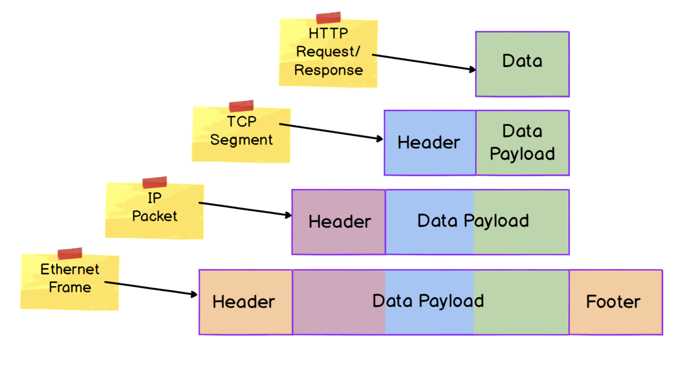

# The Internet

## What is the Internet?

### What is a network?

* A network is two or more devices connected in such way that they can communicate or exchange data

### Local Area Network (LAN)

* Multiple computers connected in an office via a switch
* Communications is limited to devices in the network

### Inter-network Communication

* We need routers, in order to enable communication between networks
* Routers route network traffic to other networks

### A network of networks

* We can imagine the internet as a vast number of these networks connected together

## Protocols

* We can think of protocols as a _system of rules_
  * "A set of rules that govern the exchange or transmission of data."

* Some widely used protocols are:
  * IP
  * SMTP
  * TCP
  * HTTP
  * Ethernet
  * FTP
  * DNS
  * UDP
  * TLS

* Why are there so many protocols?
  * Different protocols were developed to address different aspects of network communication
  * Different protocols were developed to address the same aspect of network communication but differently for a specific use case.

* TCP and UDP would be examples of two protocols that address the same fundamental aspect of communication
  * TCP provides for the transfer of messages between applications
  * HTTP defines the structure of those messages.

## A Layered System

Layers of the TCP/IP model:
1. Application
2. Transport
3. Internet
4. Link

* We are hiding data from one layer by encapsulating it within a data unit of the layer below

### Protocol Data Units (PDU)

* A PDU is a block or amount of data transferred over a network
* Different layers refer to PDUs by different names:
  * Link / Data Link Layer - **frame**
  * Internet / Network Layer - **packet**
  * Transport Layer - **segment (TCP)** or **datagram (UDP)**
* PDUs contain a header, data payload, and in some cases a footer/trailer.
  * The exact structure of a header and footer varies from protocol to protocol
  * The purpose of them is to provide protocol-specific metadata about the PDU
  * Ex. an IP packet header would include the Source IP address and the Destination IP address, which would be used to route the packet.
  * The data payload section is the data we want to transport over the network using a specific protocol at a particular network layer
  * The entire PDU from a protocol at one layer is set as the data payload for a protocol at the layer below

* A protocol at one layer doesn't need to know anything about how a protocol at another layer is implemented in order for those protocols to interact.
* It can independently complete its specific communication task without information from other layers

**SUMMARY**
* Protocols act as systems of rules for network communication.
* Groups of protocols work in a layered system. Protocols at one layer provide services to the layer above.
* Data is encapsulated into a Protocol Data Unit, creating separation between protocols operating at different layers.

## The Physical Network

* At the most basic level is a 'physical' network made of tangible pieces such as networked devices, cables, and wires
* What happens at this level involves real-world limitations and boundaries, such as how fast an electrical signal or light can travel, or the distance a radio wave can reach

### Bits and Signals

* The functionality at this level is concerned with the transfer of bits (binary data).
* In order to be transported, these bits are converted into signals
* Depending on the transportation device used, bits are converted to electrical signals, light signals, or radio signals.

### Characteristics of a Physical Network

* There are two main characteristics of the performance of the physical network are:
  * Latency
  * Bandwidth

* Latency is a measure of **time** it takes for some data to get from one point to another.
* Bandwith is the **amount** of data that can be sent in a particular unit of time (usually, a second)

### Elements of Latency

* We can think of latency as a measure of delay

* **Propogation Delay:** the amount of time it takes for a message to travel from sender to receiver, and can be calculated as the ratio between distance and speed.
* **Transmission Delay:** the amount of time it takes data to travel through wires and cables interconnected by switches, routers and other network deviced.
* **Processing Delay:** data is processed along the way, when being transported. Can think of this as a "check point".
* **Queuing Delay:** the amount of time the data is waiting in the queue to be processed.
* **Last-mile Latency:** data is usually processed near the end points. This is caused by transmission, processing, and queuing of data.
* **Round-trip Time (RTT):** This is the length of time for a signal to be sent, added to the length of time for an acknowledgement or response to be received.

We are able to see the "hops" data takes using the `traceroute` command in terminal

### Bandwidth

* Bandwidth varies across the network, and won't be at a constant level
* **Bandwidth bottleneck:** A point where bandwidth changes from high to low.
* Low bandwidth can be an issue when dealing with large amounts of data

## The Link / Data Link Layer

* The most commonly used protocol at this layer is the *Ethernet* protocol.
* The two most important aspects of Ethernet are **framing** and **addressing**

### Ethernet Frames

* Ethernet frames are a PDU, and they encapsulate data from the Internet/Network layer above.
* The Link / Data Link Layer is the lowest layer at which encapsulation takes place.
* An ethernet frame adds logical data to binary data from the physical layer

### MAC Addresses

* Every network-enabled device, with a Network Interface Card (NIC) is assigned a MAC address when manufactured
* This address does not change, and is referred to as the *physical address* or *burned-in address*
* MAC Addresses are formatted as a sequence of six two-digit hexadecimal numbers (`00:40:96:9d:68:0a`)

* MAC addresses work well for local networks, however they are not scalable due to some characteristics:
  * They are physical rather than logical. Each MAC Address is tied (burned in) to a specific physical device
  * They are flat rather than hierarchical. The entire address is a single sequence of values and can't be broken down into sub-divisions.

## The Internet / Network Layer

* The primary function of protocols at this layer is to facilitate communication between hosts (eg. computers) on different networks
* The Internet Protocol (IP) is the predominant protocol used at this layer
* Primary features of IP:
  * Routing capability via IP addressing
  * Encapsulation of data into packets

### Data Packets

* The PDU within the IP Protocol is referred to as a packet
* A packet contains a header and a data payload
* The data payload of an IP Packet is the PDU from the layer above, which is generally a TCP segment of a UDP datagram.

### IP Addresses

* IP Addresses are not tied to a specific device, but can be assigned as required to devices as they join networks
* IPv4 addresses are are 32 bits in length, divided into four sections of 8 bits each
  * The numbers must be between 0 and 255

* IPv6 uses 128-bit addresses (eight 16 bit blocks)
  * also has a different header structure than IPv4 and a lack of error checking

## Lesson Summary

* The internet is a vast network of networks. It is comprised of both the network infrastructure itself (devices, routers, switches, cables, etc) and the protocols that enable that infrastructure to function.

* Protocols are systems of rules. Network protocols are systems of rules governing the exchange or transmission of data over a network.

* Different types of protocol are concerned with different aspects of network communication. It can be useful to think of these different protocols as operating at particular 'layers' of the network.

* Encapsulation is a means by which protocols at different network layers can work together.

* Encapsulation is implemented through the use of Protocol Data Units (PDUs). The PDU of a protocol at one layer, becomes the data payload of the PDU of a protocol at a lower layer.

* The physical network is the tangible infrastructure that transmits the electrical signals, light, and radio waves which carry network communications.

* Latency is a measure of delay. It indicates the amount of time it takes for data to travel from one point to another.

* Bandwidth is a measure of capacity. It indicates the amount of data that can be transmitted in a set period of time.

* Ethernet is a set of standards and protocols that enables communication between devices on a local network.

* Ethernet uses a Protocol Data Unit called a Frame.

* Ethernet uses MAC addressing to identify devices connected to the local network.

* The Internet Protocol (IP) is the predominant protocol used for inter-network communication.

* There are two versions of IP currently in use: IPv4 and IPv6.

* The Internet Protocol uses a system of addressing (IP Addressing) to direct data between one device and another across networks.

* IP uses a Protocol Data Unit called a Packet.
