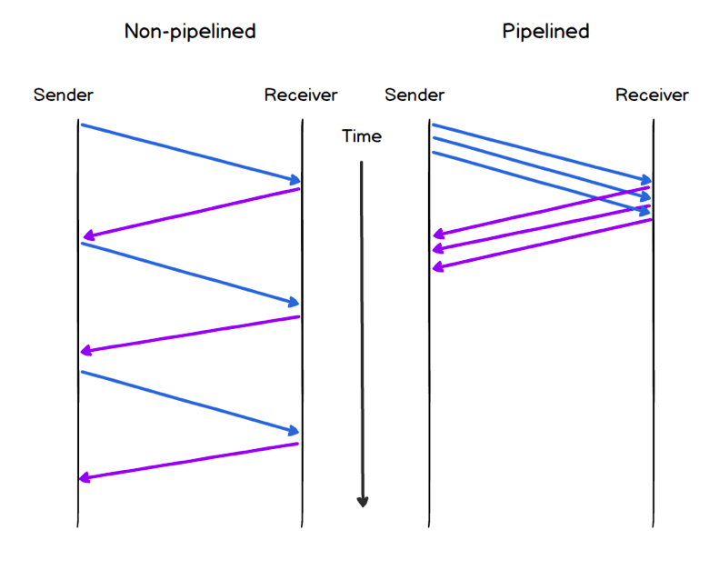
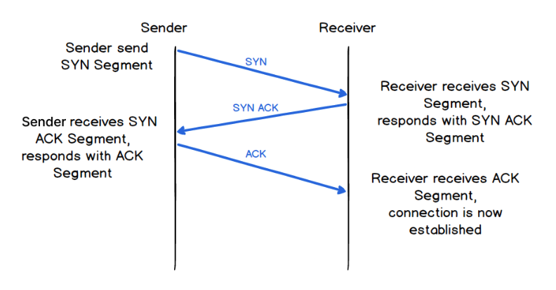
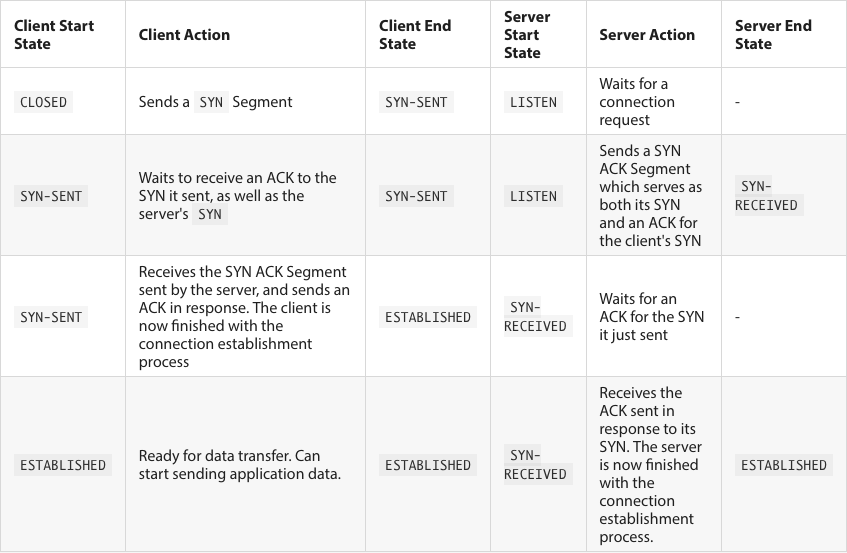

# The Transport Layer

## Communication Between Processes

### Multiplexing and Demultiplexing

* The idea of transmitting multiple signals over a single channel is known as multiplexing, and demultiplexing being the reverse process
* This takes place through the use of **network ports**

### Ports

- A port is an identifier for a specific process running on a host
- This identifier is an integer in the range of 0-65535
- 0-1023 are well known ports, for protocols such as HTTP, FTP, SMTP, etc.
- 1024-49151 are registered ports, for private entities such as Microsoft, IBM, Cisco, etc.
- 49152-65535 are private ports that cannot be registered for a specific use. They are customizable. These are called *ephermal* or temporary ports

- The source and destination port numbers are included in the PDU for the transport layer
- The combination of IP address and port number information can be thought as defining a *communication end-point*.
- This communication end-point is generally referred to as a *socket*. Eg. `216.3.128.12:8080`

### Sockets

- As outlined above, a socket is an abstraction for an endpoint used for inter-process communication
- To allow for many processes within a single Host to use TCP communication facilities simultaneously, the TCP provides a set of addresses or ports within each host. Concatenated with the network and host addresses from the internet communication layer, this forms a socket.
- We are able to implement sockets as objects create connections between applications

#### Sockets and Connections

- In a connectionless system, a socket object can be defined by the IP address of the host machine and assigned a particular process on that machine.
  - That object could call a `listen()` method which would allow it to wait for incoming messages directed to that IP/port pair.

- In a connection-oriented system, a socket object can be defined by the host IP and the process port, just like a connectionless system, also using a `listen()` method.
  - However, when a message is received, a new socket object is instantiated, and be defined by the IP/port pair of both host machines. This socket will listen for messages specifically for messages where all four peices of the info matched (source port, source IP, destination port, destination IP), known as *four-tuple*

## Network Reliability

- As software engineers, we need a *reliable communication channel* over which to send data. 
- Many of the application we build depend on reliable data transfer.

### Pipelining for Performance

- During the TCP/UDP handshake, we are able to improve performance by sending multiple messages at once, without waiting for the acknowledgement of the previous message
- This approach is called *pipelining*
- The sender will implement a "window" representing the maximum number of messages that can be in the "pipeline" at any one time.
  - Once the appropriate acknowledgements are received for the messages, it moves the window.
  - [Example simulation](http://www.ccs-labs.org/teaching/rn/animations/gbn_sr/)

- Finding a balance between reliability and performance is a major part of the implementation of the Transmission Control Protocol (TCP)

## Transmission Control Protocol (TCP)

- TCP is one of the corner-stones of the Internet
- Reliability is listed as a key element of TCP operation
- TCP must recover data that is damaged, lost, duplicated, or delivered out of order by the internet communication system
- TCP hides much of the complexity of reliable network communication from the application layer
  - Data integrity, de-duplication, in-order delivery, and retransmission of lost data
- Although it provides good reliability, TCP has an impact on performance
- TCP attempts to balance this impact by providing flow control and congestion avoidance
- TCP also provides data encapsulation and multiplexing through the use of TCP Segments

### TCP Segments

- Segments are the PDU of TCP
- Like other PDUs, segments use a combination of headers and payload to provide encapsulation of data from the layer above.

**Important Sections of Header:**
- Segments have a CHECKSUM, which provides error detection. It is a value generated by the sender using an algorithm. The receiver generates a value using the same algorithm and if it doesn't match, the segment is dropped
- SEQUENCE NUMBER and ACKNOWLEDGEMENT NUMBER: these two fields are used together to provide for the other elements of TCP reliability such as In-order Delivery, Handling Data Loss, and Handling Duplication.

### TCP Connections

* TCP is a connection-oriented protocol, meaning it doesn't start sending application data until a connection has been established.
* To establish a connection, TCP uses what is knows as a Three-way Handshake

- A key characteristic of the process is that the sender cannot send any application data until after it has sent the ACK Segment.
  - there is an entire round-trip of latency before any application data can be exchanged

### Flow Control

- Flow control is a mechanism to prevent the sender from overwhelming the receiver with too much data at once
- Data awaiting processing is stored in a 'buffer'
- Each side of a connection can let the other side know the amount of data that it is willing to accept via the WINDOW field of the TCP header
  - This number is dynamic, and can change during the course of a connection

### Congestion Avoidance

- Network Congestion is a situation that occurs when there is more data being transmitted on the network than there is network capacity to process and transmit the data
- Routers use a 'buffer' to store data that is awaiting processing, but if there is more data to be processed than can fit in the buffer, the buffer over-flows and those data packets are dropped
- TCP actually uses data loss as a feedback mechanism to detect, and avoid, network congestion; if lots of retransmissions are occurring, TCP takes this as a sign that the network is congested and reduces the size of the transmission window

### Disadvantages of TCP

- Although TCP provides reliable data transfer, and also uses flow control and congestion avoidance techniques to try and do so efficiently, there are also drawbacks to using it
- Another potential issue with using TCP is Head-of-Line (HOL) blocking
  - it relates to how issues in delivering or processing one message in a sequence of messages can delay or 'block' the delivery or processing of the subsequent messages in the sequence
  - With TCP if one of the segments goes missing and needs to be retransmitted, the segments that come after it in the sequence can't be processed, and need to be buffered until the retransmission has occurred

## User Datagram Protocol (UDP)

- The header of a UDP contains 4 sections:
  - Source Port, Destination Port, UDP Length, and a Checksum (optional if using IPv4)
- UPD also offers multiplexing like TCP

- It provides no guarantee of message delivery
- It provides no guarantee of message delivery order
- It provides no built-in congestion avoidance or flow-control mechanisms
- It provides no connection state tracking, since it is a connectionless protocol

### The Case for UDP

- UDP is unreliable, but it is fast and flexible
-  Applications using UDP at the Transport layer can just start sending data without having to wait for a connection to be established
- the lack of acknowledgements and retransmissions means that the actual data delivery itself is faster
- The lack of in-order delivery also removes the issue of Head-of-line blocking (at least at the Transport layer)

## Summary

- Multiplexing and demultiplexing provide for the transmission of multiple signals over a single channel

- Multiplexing is enabled through the use of network ports

- Network sockets can be thought of as a combination of IP address and port number

At the implementation level, network sockets can also be socket objects

- The underlying network is inherently unreliable. If we want reliable data transport we need to implement a system of rules to enable it.

- TCP is a connection-oriented protocol. It establishes a connection using the Three-way-handshake

- TCP provides reliability through message acknowledgement and retransmission, and in-order delivery.

- TCP also provides Flow Control and Congestion Avoidance

- The main downsides of TCP are the latency overhead of establishing a connection, and the potential Head-of-line blocking as a result of in-order delivery.

- UDP is a very simple protocol compared to TCP. It provides multiplexing, but no reliability, no in-order delivery, and no congestion or flow control.

- UDP is connectionless, and so doesn't need to establish a connection before it starts sending data

- Although it is unreliable, the advantage of UDP is speed and flexibility.