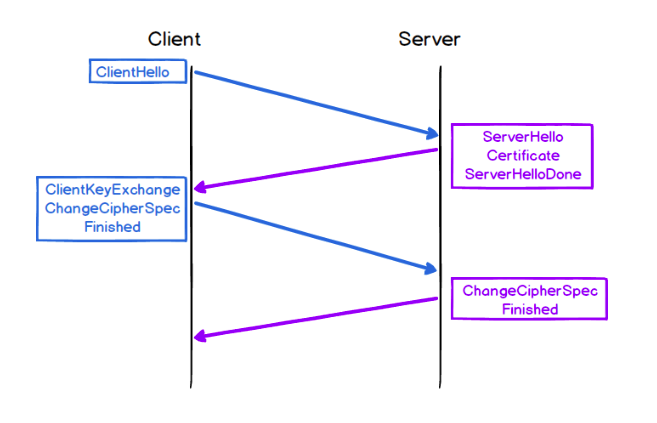
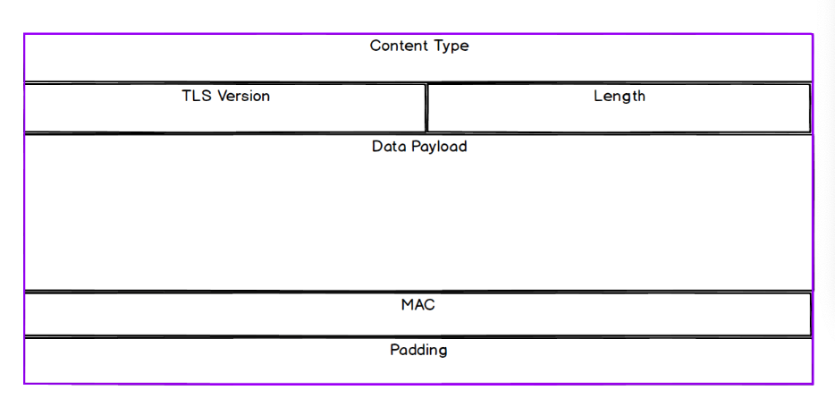

# Transport Layer Security (TLS)

## TLS Protocol

TLS provides 3 important services:
  - Encryption
  - Authentication
  - Integrity

**Encryption**:
  - a process of encoding a message so that it can only be read by those with an authorized means of decoding the message

**Authentication:**
  - a process to verify the identity of a particular party in the message exchange

**Integrity:**
  - a process to detect whether a message has been interfered with or faked

All 3 services are used simultaneously to provide secure message exchange over an unsecure channel.

## TLS Encryption

- TLS sets up an encryted connection via a process known as the **TLS Handshake**

**Symmetric Key Encryption**

- Symmetric key encryption, is a type of encryption where the same key is used for both the encryption and decryption of data.

**Asymmetric Key Encryption**

- Asymmetric key encryption, also known as public key encryption, uses a pair of keys: a public key, and a private key. Unlike the symmetric system where the same key is used to encrypt and decrypt messages, in the asymmetric system the keys in the pair are non-identical: the public key is used to encrypt and the private key to decrypt.

- The important thing to understand is that messages encrypted with the public key can only be decrypted with the private key. The public key is made openly available but the private key is kept in the sole possession of the message receiver.

### The TLS Handshake

- TLS uses a combination of symmetric and asymmetric cryptography.
- Most of the message exchange is done through symmetric keys encryption
- But the initial symmetric key exchange is conducted using asymmetric key encryption
- The process by which the initial secure connection is set up is conducted during the TLS handshake

TLS assumes TCP is being used at the Transport layer, and the TLS handshake takes place after the TCP handshake.

TLS handshake process:

1. The TLS Handshake begins with a `ClientHello` message which is sent immediately after the TCP `ACK`. This message contains:
  - the maximum version of TLS protocol that the client can support.
  - a list of Cipher Suites that the client is able to use.

2. On receiving the `ClientHello` message, the server responds with a message of its own. This message includes:
  - a `ServerHello` which sets the protocol version and Cipher Suite, as well as other related information.
  - a certificate (which contains its public key), and a `ServerHelloDone` marker which indicates to the client that it has finished with this step of the handshake.

3. Once the client has received the `ServerHelloDone` marker, it will initiate the key exchange process.
  - The symmetric key is created when both parties select a Cipher Suite to use
  - This key exchange is what enables both parties to have a copy of the symmetric key, and start to securely exchange messages.

The key points to remember are:
- Agree which version of TLS to be used in establishing a secure connection.
- Agree on the various algorithms that will be included in the cipher suite.
- Enable the exchange of symmetric keys that will be used for message encryption.

**Note:** Be aware that one of the implications of this complexity is its impact on performance. The TLS handshake can add up to two round-trips of latency (depending on the TLS version)

### Cipher Suites

- A cipher is a cryptographic algorithm; in other words they are sets of steps for performing encryption, decryption, and other related tasks. A cipher suite is a suite, or set, of ciphers.
- As part of the `ClientHello` message, the client sends a list of algorithms it supports for each required task, and the server chooses from these according to which algorithms it also supports.

## TLS Authentication

- As a response to `ClientHello` message, the server provides its certificate.
- The certificate includes two main functions:
  1. Provide a public key to the client
  2. Provide a means of identification for the party providing it
- Cetificates will contain peices of information, including who the owner is.
- It is possible for a malicious third-party to create a fake certificate, identifying as someone they are not

### Certificate Authorities & the Chain of Trust

When a CA issues a certificate, it does a couple of important things:

  - Verifies that the party requesting the certificate is who they say they are.
  - Digitally signs the certificate being issued. This is often done by encrypting some data with the CA's own private key.

There are different 'levels' of CA. An 'Intermediate CA' can be any company or body authorised by a 'Root CA' to issue certificates on its behalf.

Root CAs are essentially a small group of organisations approved by browser and operating system vendors

## TLS Integrity

To add a further layer of security, TLS provides the functionality to check the integrity of data transported via the protocol

### TLS Encapsulation

TLS is a Session Layer protocol, which exists between the Application Layer (where HTTP resides) and the Transport Layer (where TCP resides).

When transporting application data TLS encapsulates that data in the same way that we've seen with other Protocol Data Units:

- The field that interests us in terms of message integrity is the MAC (Message Authentication Code) field.
  - Note: This is unrelated to MAC Address

### Message Authentication Code (MAC)

The MAC field is similar to the checksum fields in other PDUs, as it adds a layer of security by checking that the message hasn't been altered or tampered with in transit.

This is implemented using a hashing algorithm:
  - the sender creates a digest payload
  - the sender encrypts the payload using a symmetric key
  - the receiver decrypts the payload using symmertic key, and using the same algorithm, checks if the value matches the digest payload received.

## Summary

- *HTTP Requests and Responses* are transferred in *plain text*; as such they are *essentially insecure*.

- We can use the *Transport Layer Security* (TLS) Protocol to add security to HTTP communications.

- *TLS encryption* allows us to *encode messages* so that they can only be read by those with an authorized means of decoding the message

- TLS encryption uses a combination of *Symmetric Key Encryption* and *Asymmetric Key Encryption*. Encryption of the initial key exchange is performed asymmetrically, and subsequent communications are symmetrically encrypted.

- The *TLS Handshake* is the process by which a client and a server *exchange encryption keys*.

- The *TLS Handshake* must be performed before secure data exchange can begin; it involves *several round-trips of latency* and therefore has an *impact on performance*.

- A *cipher suite* is the *agreed set of algorithms* used by the client and server during the secure message exchange.

- *TLS authentication* is a means of *verifying the identity* of a participant in a message exchange.

- TLS Authentication is implemented through the use of *Digital Certificates*.

- Certificates are *signed* by a *Certificate Authority*, and work on the basis of a *Chain of Trust* which leads to one of a small group of highly trusted *Root CAs*.

- The server's certificate is *sent* during the *TLS Handshake* process.

- *TLS Integrity* provides a means of *checking* whether a message has been *altered or interfered with* in transit.

- TLS Integrity is implemented through the use of a *Message Authentication Code* (MAC).