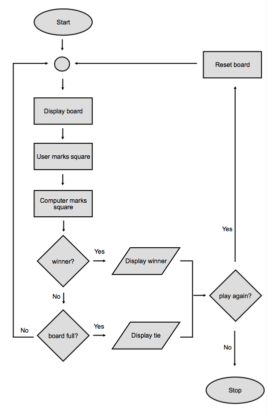

# Tic Tac Toe - Problem Decomposition

## Decomposing the problem
Tic Tac Toe is a 2 player game played on a 3x3 board. Each player takes a turn and marks a square on the board. First player to reach 3 squares in a row, including diagonals, wins. If all 9 squares are marked and no player has 3 squares in a row, then the game is a tie.

## Sequence of gameplay
1. Display the initial empty 3x3 board.
2. Ask the user to mark a square.
3. Computer marks a square.
4. Display the updated board state.
5. If winner, display winner.
6. If board is full, display tie.
7. If neither winner nor board is full, go to #2
8. Play again?
9. If yes, go to #1
10. Good bye!

Two main loops:
  * Step 7, after either the winner is found or the board is full.
  * Step 9, after we ask if the user wants to play again

## Flowchart
